MCU主要由内核、片上外设组成

嵌入式硬件主要由MCU、片外外设组成

对于嵌入式软件编程，需要关注的就是**内核、片上外设、片外外设**

内核与片上外设通过总线连接，

I-Bus总线：取指令(Instruction)。程序编译后就是一条条指令，存放在FLASH中，内核通过I-Bus总线读取指令并执行

D-Bus总线：取数据(Data)。数据分常量和变量两种。常量是固定不变的，C中用const关键字修饰，存放在FLASH中；变量是可变的，全局变量或者局部变量都存放在SRAM中

S-Bus总线：读写寄存器(System总线)。主要用来访问外设的寄存器。

DMA总线：读写数据。可以是外设的数据寄存器，可以在SRAM，可以在FLASH。因为数据可以被D-Bus总线访问，也可以被DMA总线访问，为了避免访问冲突，在取数据时，需要经过总线矩阵仲裁，决定由哪个总线来取数据

内部闪存存储器FLASH：存放程序编译文件

内部SRAM：内存。变量、堆栈等开销都是基于内部SRAM

FSMC：Flexible static memory controller(灵活的静态存储器控制器)。用来扩展静态的内存，如外部SRAM、NAND-FLASH和NORFLASH。不能扩展动态的内存，比如SDRAM

AHB：延伸出APB1和APB2两条总线，片上外设挂载在其上。这是学习STM32MCU的重点，需掌握对这些片上外设的编程，去驱动外部的设备(片外外设)

# 1.硬件环境引脚

## 1.1.硬件

1、32F407.LSPI-SKYSTAR

> | 名称 | 内容          |
> | ---- | ------------- |
> | MCU  | STM32F407VGT6 |
> | HSE  | 8 MHz         |
> | LSE  | 32.768 KHz    |

2、ST-LINK V2仿真器

3、USB TO TTL串口模块

4、接线图：


## 1.2.环境

1、Keil MDK v5.34

> 芯片包：Keil.STM32F4xx_DFP.2.17.1.pack

2、STM32CubeMX v6.14

> 固件包：STM32Cube_FW_F4_V1.28.1

3、串口助手

* [波特律动 串口助手](https://serial.baud-dance.com/#/)

* XCOM V2.7

* serialplot

* vofa+

4、keilkill.bat

## 1.3.引脚

### 1.3.0.SWD调试接口

| 引脚编号 | GPIO | 连接资源 | 位号 | 说明            |
| -------- | ---- | -------- | ---- | --------------- |
| 72       | PA13 | SWDIO    | /    | SWD接口数据引脚 |
| 76       | PA14 | SWCLK    | /    | SWD接口时钟引脚 |
| /        | /    | GND      | /    | /               |
| /        | /    | 5V       | /    | /               |

### 1.3.1.板载LED、按键等外设接口

| 引脚编号 | GPIO | 连接资源 | 位号 | 说明                                |
| -------- | ---- | -------- | ---- | ----------------------------------- |
| 37       | PB2  | /        | LED2 | 板载LED，初始低电平为灭，高电平为亮 |
| 23       | PA0  | /        | SW2  | 板载KEY，初始低电平                 |

### 1.3.2.串口

| 引脚编号 | GPIO | 连接资源  | 位号 | 说明       |
| -------- | ---- | --------- | ---- | ---------- |
| 68       | PA9  | USART1_TX | /    | 串口1-TX脚 |
| 69       | PA10 | USART1_RX | /    | 串口1-RX脚 |
| /        | /    | GND       | /    | /          |

# 2.空项目

将该项目重命名为`0.Template`，以便其他项目参考

## 2.1.打开STM32CubeMX

在Windows系统中启动该程序

> STM32CubeMX项目文件`..\project.ioc`

## 2.2.进入MCU选择

点击`Start My project from MCU-->ACCESS TO MCU SELECTOR` 从主控芯片开始我的项目-->进入主控芯片选择

>  

## 2.3.检索MCU

在`Commercial Part Number (商业部件号)`后输入要使用的主控芯片号信息以检索

> 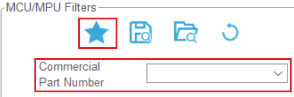 

## 2.4.选择(并收藏)MCU

在`MCUs/MPUs List`中选择具体的MCU，选择左侧的五角星收藏该MCU，以便下次选择

在上方可查看该MCU的Features、Docs & Resources、Datesheet

> 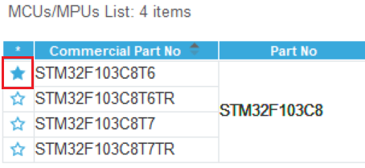 

## 2.5.开始项目

点击`Start Project`

>  

## 2.6.配置时钟源

选择`Pinout & Configuration-->System core-->SYS-->RCC-->High Speed Clock (HSE)、Low Speed Clock (LSE)::Crystal/Ceramic Resonater`(时钟源)

> 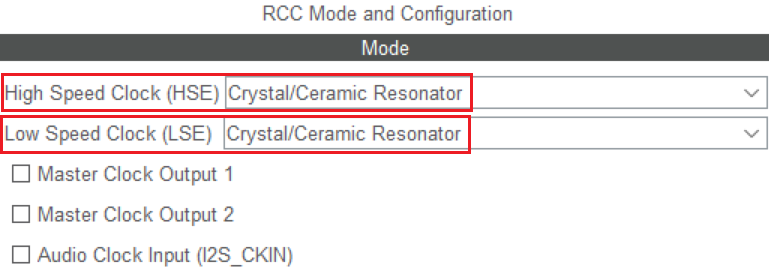 

## 2.7.配置调试模式

片上外设的配置涉及到GPIO的复用功能，会对下载调试引脚进行配置，若不进行手动配置下载调试引脚，会导致相关引脚的下载调试功能关闭，出现下载了一次程序后，就无法下载程序的情况(No Device Found)

选择`Pinout & Configuration-->System core-->SYS-->Debug::Serial Wire`(SWD调试模式)

> 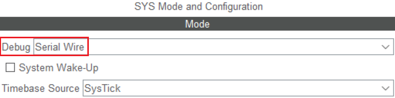 
>
> 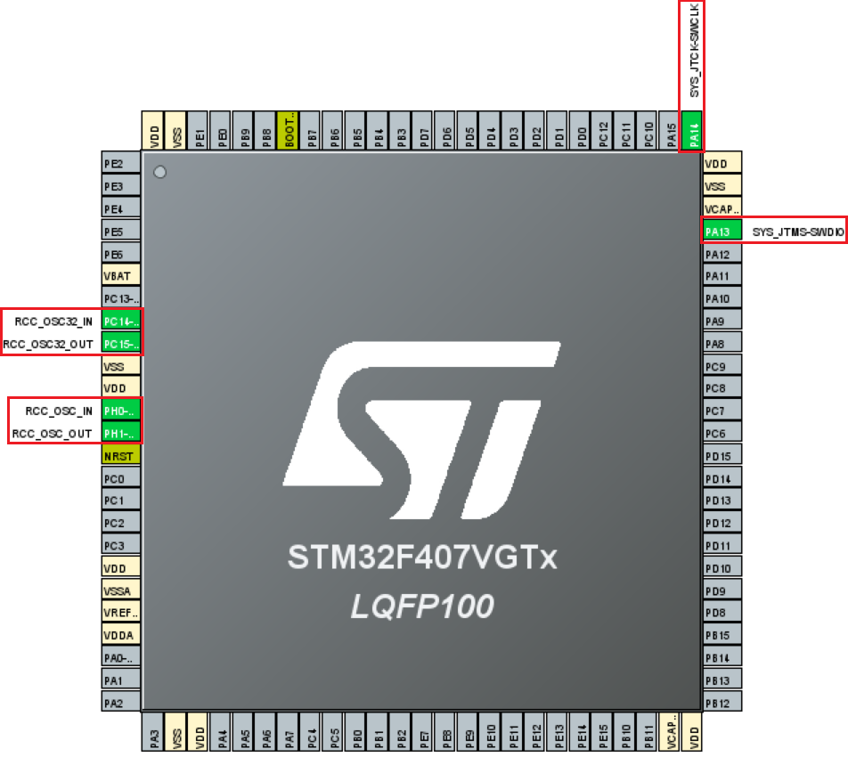 

## 2.8.配置时钟树

### 2.8.1.配置最大时钟频率

选择`Clock Configuration-->HCLK(MHz)::168 MHz max`(最大时钟频率)，回车，OK

> 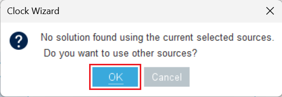 

### 2.8.2.配置外部时钟

根据原理图填写LSE、HSE的值，该电路板使用的是 8 MHz HSE、32.768 KHz LSE

> 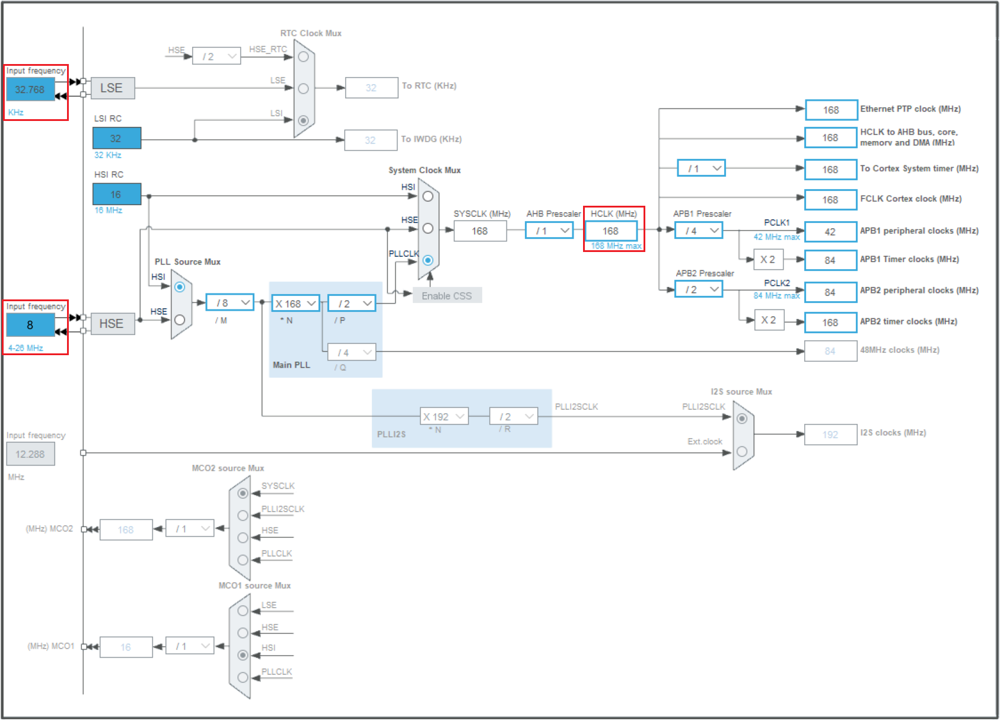 

## 2.9.项目管理

### 2.9.1.项目

`Project Manager-->Project`

#### 2.9.1.1.项目设置

`Project Settings`

* `Project Name`：project
* `Project Location`：英文路径
* `Toolchain/IDE`：MDK-ARM

> 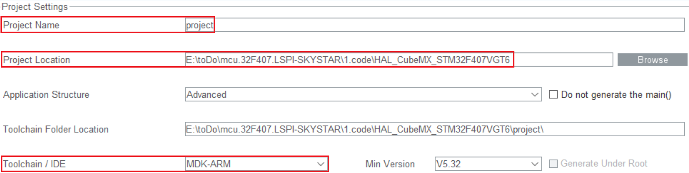 

#### 2.9.1.2.配置固件包

`Mcu and Firmware Package`

设置仓库默认下载路径：`Help-->Connection & Updates-->Updater Settings::Repository Folder`

可取消勾选`Use latest available version`，在`Firmware Package Name and Version`选择已下载的固件包

> 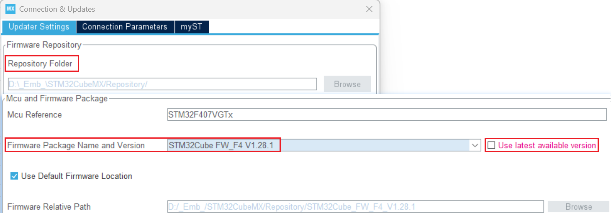 

### 2.9.2.代码生成器

`Code Generator`

> 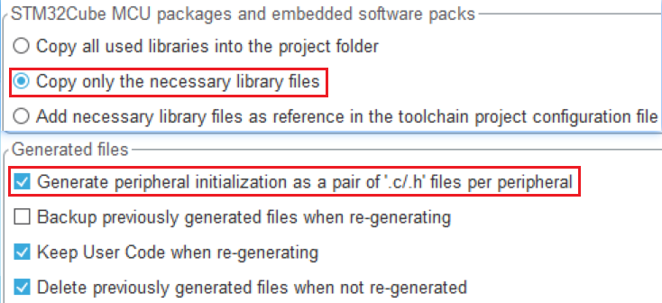 

## 2.10.生成代码

点击`GENERATE CODE`

>  

## 2.11.打开项目

`Open Project` 

> 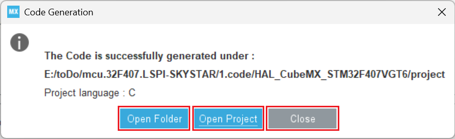 

进入Keil MDK IDE

> Keil MDK IDE 项目文件：`..\MDK-ARM\project.uvprojx`

## 2.12.Keil MDK IDE设置

### 2.12.1.设置编码方式

`Configuration-->Editor-->Encoding::UTF-8`

> 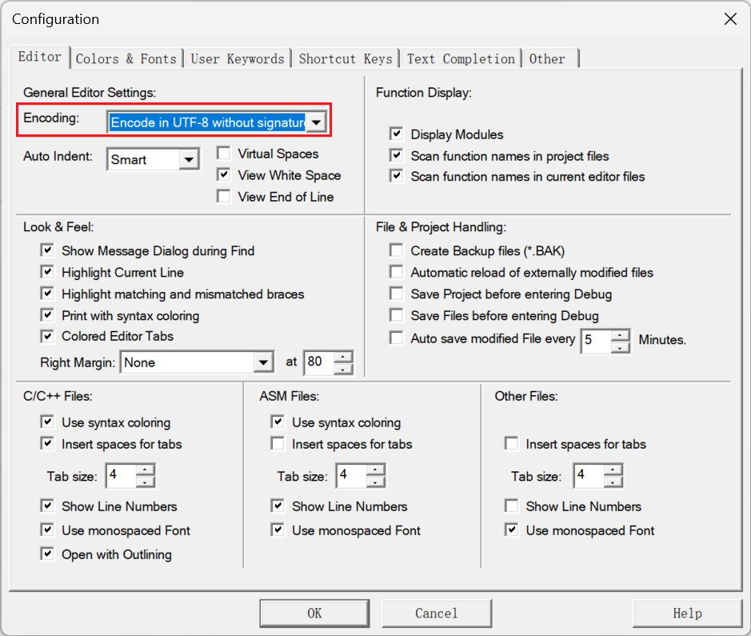 

### 2.12.2.输出设置

`Options for Target 'project'-->Output`

HEX为编译文件(必须)，用于下载到电路板中执行

Debug、Browse为编译信息，用于调试，若不用调试，只编译下载，可取消以提升编译速度

> 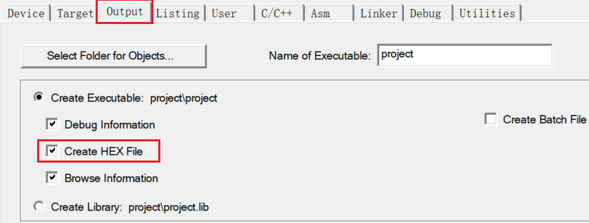 

### 2.12.3.检查勾选`Use Memory Layout`

`Options for Target 'project'-->Linker`

若未勾选，编译下载后，电路板不能正常运行

> 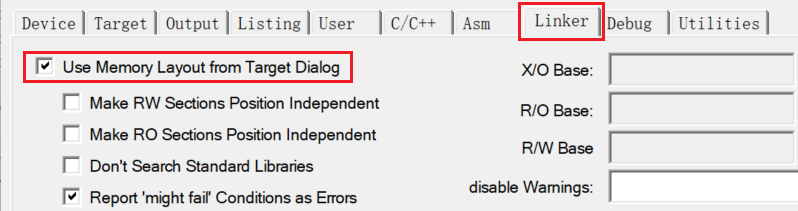 

### 2.12.3.调试工具设置

`Options for Target 'project'-->Debug`

>  

### 2.12.14.设置下载后重启并运行

`Options for Target 'project'-->Utilities`

> 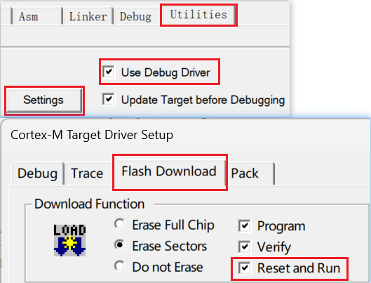 

### (2.12.15.添加用户源文件和头文件路径)

将用户源文件和头文件放在`..\User`目录下

`Options for Target 'project'-->C/C++`

在`Include Paths`添加用户头文件路径

> 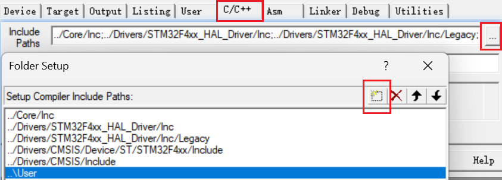 

在`Manage Project Items`添加项目树用户目录，添加用户源文件

>  
>
> 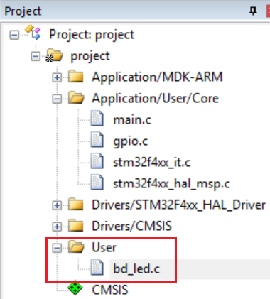 

## 2.13.编译项目

> 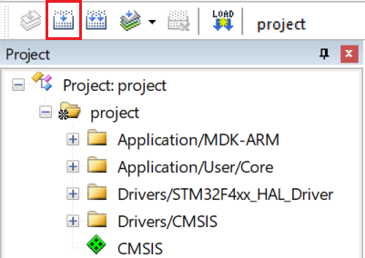 
>
> 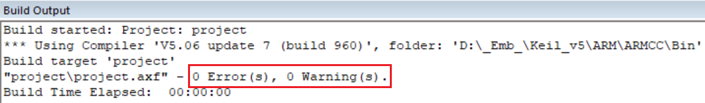 

## 2.14.下载项目

使用仿真器连接电路板

> 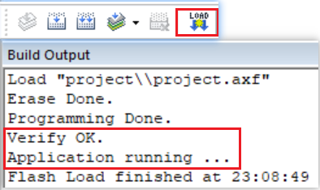 

## 2.15.项目功能

无

## 2.16.清理项目

将`keilkill.bat`放在项目根目录下，左键双击运行，自动清理根目录下所有项目的调试信息(保留编译文件，可下载执行)，减小项目所占空间大小

# 3.板载外设驱动

该项目为`1.Board`

可按“2.空项目”步骤开始一个新项目

也可直接复制“2.空项目”`0.Template`，重命名，然后进行相关资源的配置

## 3.1.板载LED驱动

### 3.1.1.原理图

> 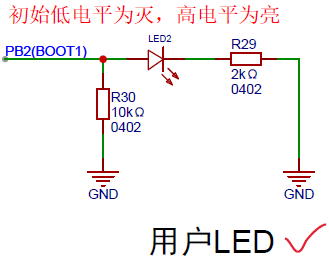 

R30电阻：下拉

R29电阻：限流

### 3.1.2.GPIO初始化

`STM32CubeMX-->Pinout & Configuration-->Pinout view`

#### 3.1.2.1.选择引脚

左键选择PB2引脚

或者在下方搜索框内检索快速定位引脚

选择`GPIO_Output`模式

> 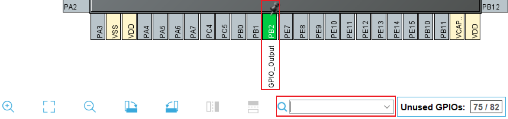 

#### 3.1.2.2.GPIO配置

`Pinout & Configuration-->System core-->GPIO-->PB2 Configuration`

> 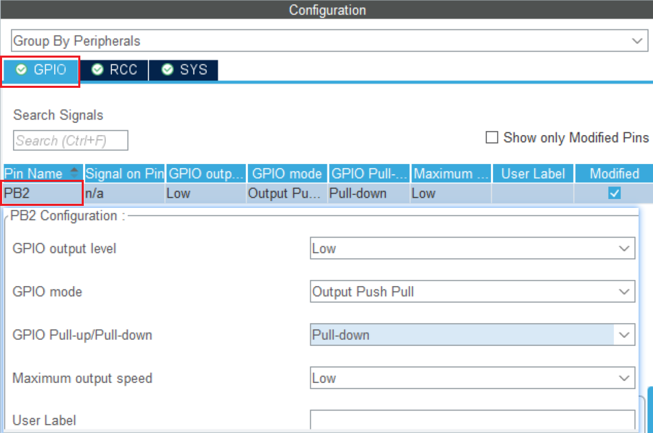 

#### 3.1.2.3.生成代码

`Keil MDK IDE-->gpio.c`

```c
/** Configure pins as
        * Analog
        * Input
        * Output
        * EVENT_OUT
        * EXTI
*/
void MX_GPIO_Init(void)
{

  GPIO_InitTypeDef GPIO_InitStruct = {0};

  /* GPIO Ports Clock Enable */
  __HAL_RCC_GPIOC_CLK_ENABLE();
  __HAL_RCC_GPIOH_CLK_ENABLE();
  __HAL_RCC_GPIOB_CLK_ENABLE();
  __HAL_RCC_GPIOA_CLK_ENABLE();

  /*Configure GPIO pin Output Level */
  HAL_GPIO_WritePin(GPIOB, GPIO_PIN_2, GPIO_PIN_RESET);

  /*Configure GPIO pin : PB2 */
  GPIO_InitStruct.Pin = GPIO_PIN_2;
  GPIO_InitStruct.Mode = GPIO_MODE_OUTPUT_PP;
  GPIO_InitStruct.Pull = GPIO_PULLDOWN;
  GPIO_InitStruct.Speed = GPIO_SPEED_FREQ_LOW;
  HAL_GPIO_Init(GPIOB, &GPIO_InitStruct);

}
```

### 3.1.3.板载LED驱动程序

头文件

```c
#ifndef __BD_LED_H
#define __BD_LED_H

#include "gpio.h"


/* 引脚定义 */
#define BD_LED0_GPIO_Port GPIOB
#define BD_LED0_Pin       GPIO_PIN_2    /* IO置低电平，LED灭 */

/* LED模式定义 */
#define BD_LED0(x)    do{ x ? \
                      HAL_GPIO_WritePin(BD_LED0_GPIO_Port, BD_LED0_Pin, GPIO_PIN_SET) : \
                      HAL_GPIO_WritePin(BD_LED0_GPIO_Port, BD_LED0_Pin, GPIO_PIN_RESET); \
                  }while(0)                                                          /* x = 1 , IO置高电平；x = 0 , IO置低电平 */

/* LED模式取反 */
#define BD_LED0_TOGGLE()    do{HAL_GPIO_TogglePin(BD_LED0_GPIO_Port, BD_LED0_Pin);}while(0)       /* LED = !LED */

/* 接口函数 */
void bd_led_init(void);
void bd_led_example(void);

#endif

```

源文件

```c
#include "bd_led.h"

void bd_led_init(void)
{
    /* 使用CubeMX生产STM32配置代码时，在 gpio.c 中初始化所有IO */
    //MX_GPIO_Init();
}

/**
  * @brief  bd_led example.
  * @param  None
  * @retval None
  */
void bd_led_example(void)
{
    BD_LED0(0);
    HAL_Delay(500);
    
    BD_LED0(1);
    HAL_Delay(500);
}

```

### 3.1.4.驱动验证

在`main.c`中

```c
#include "bd_led.h"

int main(void)
{
  HAL_Init();
  SystemClock_Config();
  MX_GPIO_Init();
    
  bd_led_init();
  while (1)
  {
      bd_led_example();
  }
}
```

程序现象：

编译下载，按下复位键，板载LED闪烁

## 3.2.板载按键驱动


# 4.串口驱动

该项目为`2.serial`

## 4.1.原理图

USART为片上外设，不需要外部电路就可工作，只需使用USB To TTL串口模块就可与电脑通信

## 4.2.串口初始化

`Pinout & Configuration-->Connectivity-->USART1`

Universal Synchronous / Asynchronous Recerver & Transmitter

通用同步/异步接收器&发送器

> 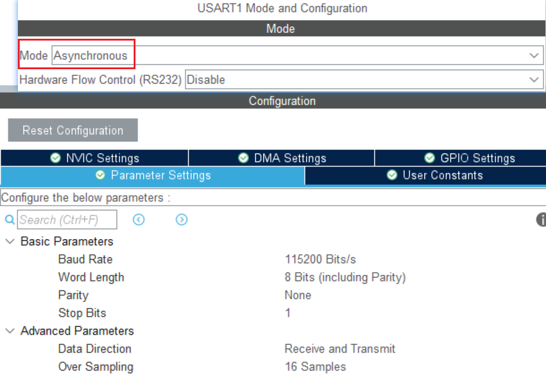 

## 4.3.接线

STM32的TX、RX、GND-->USB To TTL模块的RX、TX、GND-->电脑

打开串口调试助手，选择合适的COM口、波特率、字符长度、校验位、停止位，连接

## 4.4.轮询模式

程序必须等待串口操作完成，才能接着执行

只能接收确定长度的数据

```c
/* 串口发送 */
HAL_UART_Transmit(UART_HandleTypeDef *huart, const uint8_t *pData, uint16_t Size, uint32_t Timeout);

/* 串口接收 */
HAL_UART_Receive(UART_HandleTypeDef *huart, uint8_t *pData, uint16_t Size, uint32_t Timeout);

/* printf函数重定向
 * 重定义fputc函数
 * 供printf函数最终调用，输出字符串 */
int fputc(int ch, FILE *f)
{
    /* 等待上一个字符串发送完成
     * 对 USART的 状态寄存器SR 的 位6 TC发送完成(Transmission complete) 位与操作 0X40(即01000000)
     * 当TC为0，表示发送未完成，(SR & 0X40)为0，while循环条件为真，因为无操作，所以等待
     * 当TC为1，表示发送已完成，(SR & 0X40)为1，while循环条件为假，跳过while循环 */
    while ((USARTx->USART_ISR & 0X40) == 0);
    
    /* 将要发送的字符 ch 写入到 USART的 发送数据寄存器TDR */
    USARTx->USART_TDR = (uint8_t) ch;
    
    return ch;
}
```

## 4.5.中断模式

每发送/接收一字节时，触发“发送数据寄存器空中断/接收数据寄存器非空中断”，内核进行搬运数据的操作，当所有数据传输完成时，内核进行数据处理操作

`Pinout & Configuration-->System Core-->NVIC`

`Priority Group`优先级组设置为：`2 bits`

将USART的通用中断的抢占优先级(Preemption)设置为3(数字越小优先级越高)，子优先级(Sub)设置为3

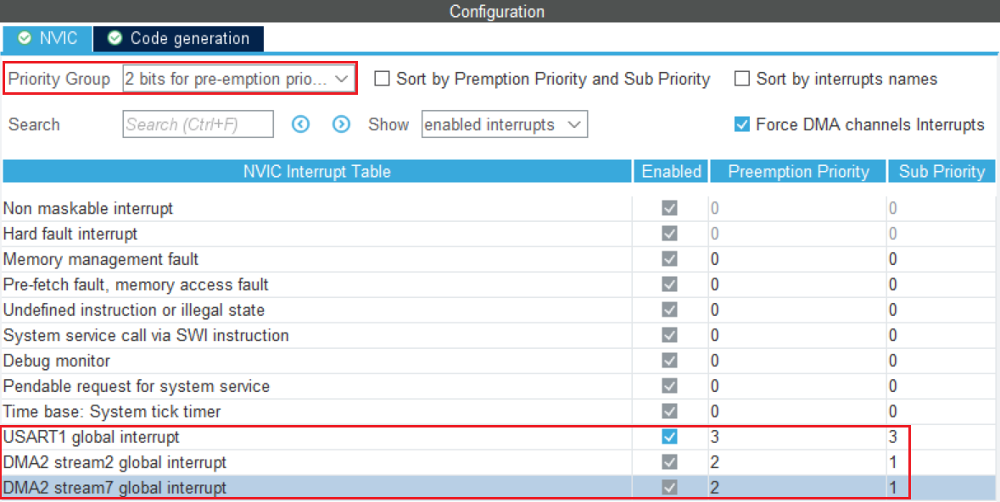 

```c
/* USART1中断向量对应的中断处理函数
   USART的各种中断事件被连接到同一个中断向量，需要判断当前是因何原因触发的中断，
   引出了Callback回调函数机制，当有什么事件发生时，就会调用对应的回调函数
   */
void USART1_IRQHandler(void);

/******************************************************************/

uint8_t receiveData[2];

void cp_serial_init(void)
{
    //MX_USART1_UART_Init();
    
    /* 开启接收中断 */
    HAL_UART_Receive_IT(&huartx,receiveData,2);
}

/* UART接收完成回调函数 */
void HAL_UART_RxCpltCallback(UART_HandleTypeDef *huart)
{
    /* 判断使用此回调函数的串口 */
    if(huart->Instance==USARTx)
    {
        /* 发送接收到的数据 */
        HAL_UART_Transmit_IT(&huartx,receiveData,2);
        
        /* 数据的处理逻辑 */
        
        
        /* 再次开启接收中断 */
        HAL_UART_Receive_IT(&huartx,receiveData,2);
    }
}
```

## 4.6.DMA模式

Direct Memory Access

直接内存访问

创建DMA通道，告诉DMA在合适时机将数据从源地址搬到目标地址

例如为串口的接收和发送创建两条DMA通道，就可让DMA在串口的寄存器与内存变量之间搬运数据

发送/接收完成时，触发“DMA传输完成中断”，内核进行数据处理操作

将两个DMA通道的抢占优先级配置为2，子优先级配置为1

`Pinout & Configuration-->Connectivity-->USART1-->DMA Settings`

将接收DMA通道优先级设为High

> 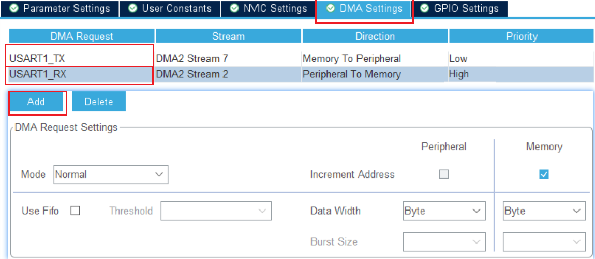 

收发定长数据

```c
uint8_t receiveData[2];

void cp_serial_init(void)
{
    //MX_USART1_UART_Init();
    
    /* 开启接收中断 */
    HAL_UART_Receive_IT(&huartx,receiveData,2);
}

/* UART接收完成回调函数 */
void HAL_UART_RxCpltCallback(UART_HandleTypeDef *huart)
{
    /* 判断使用此回调函数的串口 */
    if(huart->Instance==USARTx)
    {
        /* 发送接收到的数据 */
        HAL_UART_Transmit_DMA(&huartx,receiveData,2);
        
        /* 数据的处理逻辑 */
        
        
        /* 再次开启接收中断 */
        HAL_UART_Receive_DMA(&huartx,receiveData,2);
    }
}
```

收发不定长数据

```c
uint8_t receiveData[200];

void cp_serial_init(void)
{
    //MX_USART1_UART_Init();
    
    /* 开启DMA接收串口空闲中断 */
    HAL_UARTEx_ReceiveToIdle_DMA(&huartx,receiveData,sizeof(receiveData));
    /* 关闭DMA传输过半中断(否则也将触发RxEventCallback回调函数) */
    __HAL_DMA_DISABLE_IT(&hdma_usart1_rx,DMA_IT_HT);    /* (DMA通道的指针地址 , 要关闭的中断) */
}

/* UART接收事件回调函数 */
void HAL_UARTEx_RxEventCallback(UART_HandleTypeDef *huart, uint16_t Size)
{
    /* 判断使用此回调函数的串口 */
    if(huart->Instance==USARTx)
    {
        /* 发送接收到的数据 */
        HAL_UART_Transmit_DMA(&huartx,receiveData,Size);
        
        /* 数据的处理逻辑 */
        
        
        /* 再次开启DMA接收串口空闲中断 */
        HAL_UARTEx_ReceiveToIdle_DMA(&huartx,receiveData,sizeof(receiveData));
        /* 关闭DMA传输过半中断(否则也将触发RxEventCallback回调函数) */
        __HAL_DMA_DISABLE_IT(&hdma_usart1_rx,DMA_IT_HT);    /* (DMA通道的指针地址 , 要关闭的中断) */
    }
}
```

串口空闲中断(Idle)，此中断的触发条件与接收的数据长度无关，只有当RX引脚上无后续数据进入，即串口接收从忙碌转为空闲时，才会触发。可以认为当串口空闲中断(Idle)触发时，就是一帧数据包接收完成，再进行数据处理即可


 
